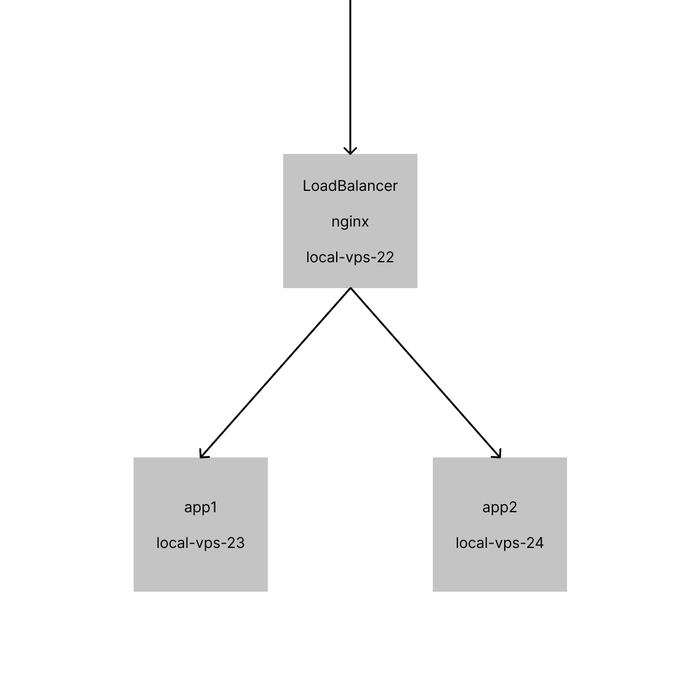

# ansible-apps

В прошлом уроке мы использовали `copy` и `template` чтобы отправлять файлы на сервер.

Наша файловая структура выглядела так:

```
docker-compose.yml
hosts.ini
nginx.conf
playbook.yaml
server.conf.j2
```

Это совсем не удобно и если у нас будет больше файлов и шаблонов, то в папке будет хаос,
в котором сложно разобрать, где что находится.

Для того, чтобы организовать файлы в плейбуках Ansible, нужно создать директории `files`
и `templates`:

```
files/
  nginx.conf
templates/
  server.conf.j2

docker-compose.yml
hosts.ini
playbook.yaml
```

Теперь, когда будете использовать модуль `copy`, то не надо добавлять `files/`, чтобы
Ansible вытащил файл `nginx.conf`. Ansible по умолчанию будет брать файлы из папки `files/`.

```yaml
copy:
  src: nginx.conf
  dest: /etc/nginx/nginx.conf
```

То же самое касается шаблонов.

```yaml
template:
  src: server.conf.j2
  dest: /etc/nginx/conf.d/server.conf
```

Благодаря этому в плейбуках Ansible можно организовывать структуры файлов и папок, чтобы
отдельно держать шаблоны и файлы.

### docker-compose

Для текущего задания, мы подготовили для удобства `docker-compose.yaml`:

```yaml
services:
  local-vps-22:
    image: atlekbai/local-vps:latest
    container_name: local-vps-22
    ports:
      - "22:22"
      - "80:80"
      - "7070:7070"
      - "8080:8080"
      - "8888:8888"
      - "9090:9090"
    restart: always
    command: "22"
    volumes:
      - "~/.ssh/id_rsa.pub:/root/.ssh/authorized_keys:ro"

  local-vps-23:
    image: atlekbai/local-vps:latest
    container_name: local-vps-23
    ports:
      - "23:23"
    restart: always
    command: "23"
    volumes:
      - "~/.ssh/id_rsa.pub:/root/.ssh/authorized_keys:ro"

  local-vps-24:
    image: atlekbai/local-vps:latest
    container_name: local-vps-24
    ports:
      - "24:24"
    restart: always
    command: "24"
    volumes:
      - "~/.ssh/id_rsa.pub:/root/.ssh/authorized_keys:ro"
```

Используйте его для запуска учебного контейнера.

> ❗️ Если ранее запускали контейнер и туда заливали свой ключ, удалите отпечаток от предыдущего `ssh-keygen -R 127.0.0.1`.

### Полезное

- [Upstream в nginx](http://nginx.org/en/docs/http/ngx_http_upstream_module.html)

### Задание

В данном задании мы реализуем функционал балансировщика нагрузки (англ. "loadbalancer").
В роли балансировщика будет служить nginx на `local-vps-22`, а перенаправлять запросы
будем на сервера `local-vps-23` и `local-vps-24`, которые является абсолютными копиями
друг друга.



1. В репозитории `jusan-ansible` создайте ветку `apps`, которая исходит от ветки `template`.
   Ввести работу будем в нем.
2. Создайте директории `files` и `templates`. Перенесите файлы и шаблоны по папкам.
3. В инвентаре `hosts.ini` добавьте группу `app`, которая содержит хосты:

```ini
app1 ansible_host=127.0.0.1 ansible_port=23 ansible_user=root
app2 ansible_host=127.0.0.1 ansible_port=24 ansible_user=root
```

2. В плейбуке `playbook.yaml` добавить плей на хосты группы `app`:

- Добавьте таск(и), который выполняет следующие операции в Ansible, при этом не использовать модули `shell`,`command`:

```bash
   cd /tmp
   curl -LO https://github.com/jusan-singularity/track-devops-systemd-api/releases/download/v0.1/api
   chmod 755 api
```

- Из задания [service-api](https://stepik.org/lesson/679792/step/5?unit=678429) можете
  взять конф.файл `api.service`, который запускает скачанный бинарник как сервис. Сохраните
  этот файл в `files`. Этот файл нужно перенести на сервер (определите куда надо).
- Запустить `api.service` как сервис.

3. Создайте шаблон `app.conf.j2` - сервер блок, который перенаправляет запросы на `local-vps-23` и
   `local-vps-24` (определите на какой порт). В ответе от запроса должен быть хедер
   `X-Upstream`, который показывает ip-адрес сервера, который был выбран upstream'ом.

4. Шаблон `app.conf.j2` должен принимать переменные и генерировать следующий конф.файл:

```yaml
server_port: 9999 # <------------- порт, который слушает
server_name: example.com # <-- имя сервера
apps: # <----------------------- список бекендов для upstream
  - app1:port # определите на какой port
  - app2:port # определите на какой port
```

```nginx
upstream app {
    server app1:port;
    server app2:port;
}

server {
    listen 9999;
    server_name example.com;
    location / {
        proxy_pass http://app;
        add_header  X-Upstream  $upstream_addr;
    }
}
```

5. Добавьте новый таск для группы `lb`, который записывает шаблон с переменными в нужную директорию.
   После выполнения вызывать хендлер `nginx-reload`. Использовать переменные:

```yaml
server_port: 80
server_name: jusan-apps.kz
apps:
  - local-vps-23:9090
  - local-vps-24:9090
```

6. Запустите плейбук и проверьте работоспособность.
7. Запушить в гит. В папке должен присутствовать обновленный `docker-compose.yaml`

Чтобы проверить правильно ли запущено все, запустите тестировщик [checker-apps.sh](https://stepik.org/media/attachments/lesson/698792/checker-apps.sh).

```bash
bash checker-apps.sh
```

---

### Ответ
