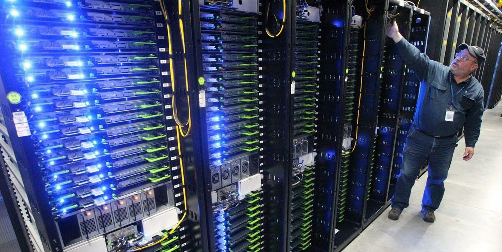
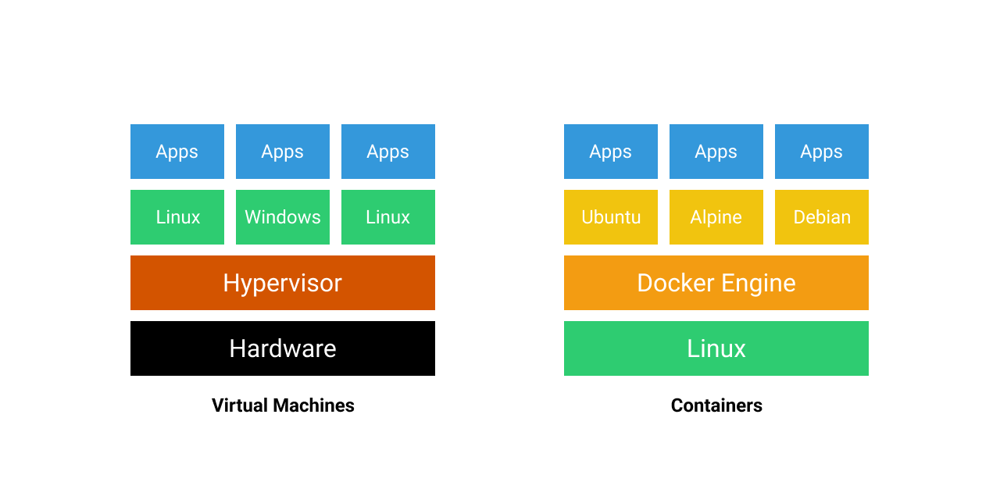
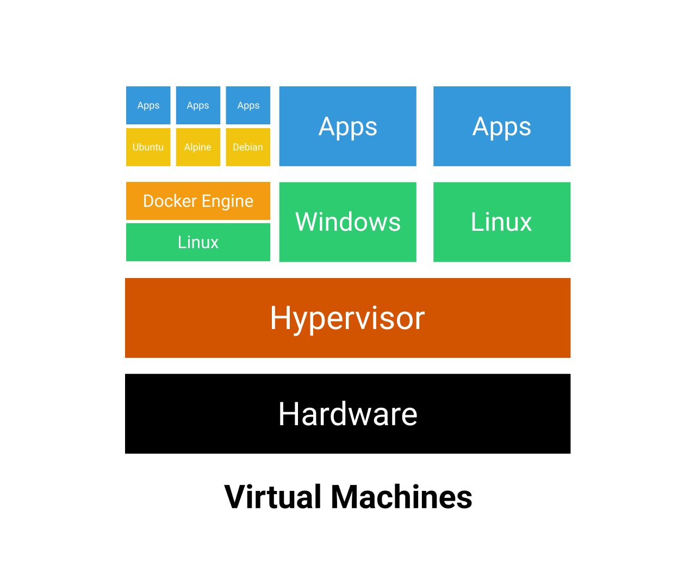

# docker-init

Добро пожаловать на модуль Docker!

Перед тем как перейдем к освоению теории, нам нужно разобрать основные термины.

<table>
<tr>
    <th>Название</th>
    <th>Описание</th>
</tr>
<tr>
    <td>Docker</td>
    <td>
        инструмент для управления контейнерами
    </td>
</tr>
<tr>
    <td>Контейнер</td>
    <td>
        изолированная среда, в которое запущено приложение. 
        Запускается на основе образа.
    </td>
</tr>
<tr>
    <td>Образ</td>
    <td>
        упакованный в архив пакет программного обеспечения, 
        который включает в себя все необходимое для запуска приложения: 
        код, среду выполнения, системные инструменты, 
        системные библиотеки и настройки. 
    </td>
</tr>
<tr>
    <td>Хостовая система</td>
    <td>
        система, в которой запущен контейнер
    </td>
</tr>
</table>

Docker - это инструмент для работы с контейнерами. Контейнеры запускаются в изолированном окружении от хостовой системы.

Для запуска контейнеров используются технологии из ядра хостовой системы.

Контейнер можно сравнить с виртуальной машиной, которая работает автономно со своей операционной системой, набором приложений, сетью и дисками.

## Виртуализация

Удаленные сервера VPS (англ. _"Virtual Private Server"_) физически находятся в защищенном здании
с серверным оборудованием. Такие здания называют дата-центром. Ниже представлена фотография
одного из таких дата-центров.

Аппаратное оборудование по сути является таким же компьютером как и у нас в домах, но только с
более мощными ресурсами процессора и оперативной памяти.

На каждом таком физическом сервере запускают несколько виртуальных машин. Каждая виртуальная
машина имеет разные операционные системы. Программу, которая создает виртуальные машины
называют _Гипервизором_.

Каждая виртуальная машина изолирована. Если одну из них взломают, то невозможно будет
получить доступ к другой.

Преимущества виртуализации:

- Возможность установки ограничения по ресурсам: CPU, RAM.
- Удобство администрирования.
- Можно собирать из образа или снепшота.

## Контейнеры

Контейнеры можно представить как виртуальные машины от гипервизора. Отличие только в том,
что изоляция происходит не на уровне железа, а на уровне ядра ОС.

При обычной виртуализации изоляции происходит на аппаратном уровне, то есть на уровне физического сервера.

В картинке ниже представлено сравнение двух видов виртуализации.

Гипервизор отвечает за управление виртуальными машинами. На виртуальных машинах запущены
приложения.

Docker Engine отвечает за управление контейнерами. В контейнерах запущено приложение.

Как вы могли заметить - виртуализация может быть двух-уровневой. Сначала
виртуализация на уровне гипервизора, далее на уровне ядра Линукс.

Преимущество контейнерной виртуализации в том, что не требуется запускать для каждого контейнера
большинство сервисов необходимых отдельной виртуальной машине:

- систему инициализации, такую как systemd;
- логирование;
- систему работ с внешними устройствами и др.

Контейнерная виртуализация использует часть технологий, которые предоставляются хостовой системой.

Docker использует следующие технологии хостовой системы Linux:

- namespaces - технология, позволяющая изолировать сеть, процессы, межпроцессорное взаимодействие и файловую систему;
- cgroups - позволяет ограничивать контейнер по ресурсам: CPU, RAM, I/O;
- UnionFS - тип файловой системы, позволяющий накладывать cлой состояния файловой системы: каждый последующий слой хранит изменения только от предыдущего слоя.

## Образы

Docker хранит образы в формате [libcontainer](https://www.docker.com/blog/docker-0-9-introducing-execution-drivers-and-libcontainer/).
Данный формат стал стандартом для хранения образов.

Для общения с Docker - есть командный инструмент `docker`. В данном модуле мы разберем основные команды `docker`.
