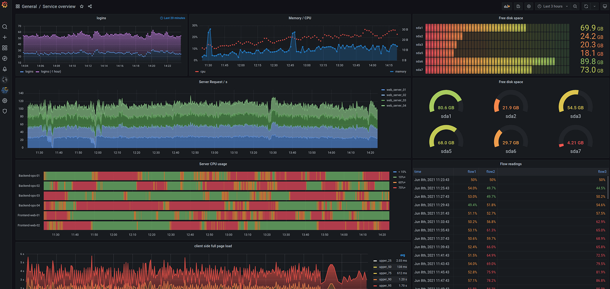

# monitoring-init

За запущенными сервисами можно следить несколькими путями:

- Просмотр логов сервиса – будут полезны как логи контейнера, так и логи `nginx`;
- Просмотр использования ресурсов (RAM, CPU) через `top` или `ps`;
- Проверить работает ли сервис, сделав запрос, либо зайдя на страницу в браузере;
- Отзывы от пользователей. Например когда сервис не работает, то пользователи могут
  пожаловаться. До такого не стоит доводить.
- Сервисы realtime мониторинга - Prometheus + Grafana.

Мониторинг сервисов является крайне важной частью проекта. Это позволяет следить за
жизнеспособностью запущенного сервиса, наблюдать за нагрузкой и в случае появления
ошибок отправлять сигнал тревоги ответственным лицам

В этом модуле разберем два основных сервиса мониторинга Prometheus (сборщик метрик) и Grafana (визуализация метрик в real-time).

## Prometheus & Grafana

Prometheus и Grafana идеально работают вместе. Сейчас объясним зачем нужны эти два сервиса.

Prometheus - это база данных метрик, которые он получает от разных сервисов.
Метрики хранят состояние сервиса в определенный момент времени, которые, чаще всего, представлены числовым значением.

У Prometheus есть своя диаграмма для визуализации метрик, однако она очень ограничена.

Grafana - это мощный инструмент для визуализации любых метрик. Но именно связка
с Prometheus является наиболее распространенной. С помощью графаны можно выводить
несколько диаграмм на один дэшборд и в режиме реального времени следить
как ведет себя сервис.

Ниже представлен пример дэшборда в Grafana.

В данном модуле научимся с нуля настраивать Prometheus + Grafana и строить дэшборды.
