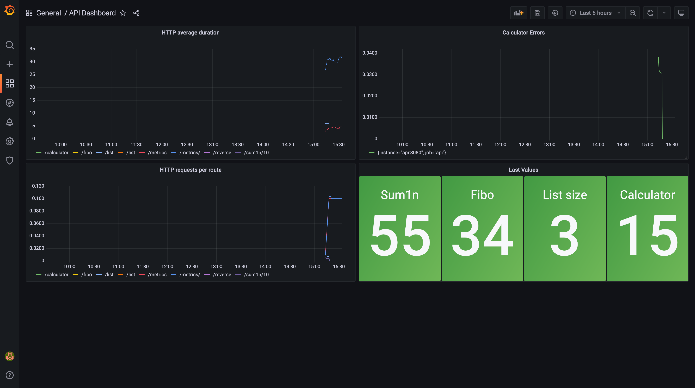

## Рецензия

### Дополнительная информация


Рецензия - это проверка проекта другого учащегося. Перед тем, как приступить к рецензированию, ознакомьтесь с правилами проведения рецензии.

**Правила рецензии:**

- Проверять только выполненную работу.
- Следовать указаниям критериев оценки.
- Если проект учащегося соответствует критерию, то ставьте 1.
- Если проект учащегося не соответствует критерию, то ставьте 0.

### Критерий оценки #1

GitHub ссылка рабочая и ведет на репозиторий с выполненным заданием на ветку `monitoring`.

В ответе студента есть ссылка-приглашение на группу в Телеграмме для оповещении от Grafana.
Присоединитесь к этой группе. По окончанию рецензирования можете выйти из группы.

Если это не так, то ставьте оценку 0 и заканчивайте проверку.

### Критерий оценки #2

Убедитесь, что API запускается в одном треде. Проверить это можно следующими способами:

- Если в Dockerfile есть линия в начале `FROM tiangolo/uvicorn-gunicorn-fastapi`, то в файле снизу должна быть строка `ENV MAX_WORKERS=1`;
- Если в конце Dockerfile есть вызов команды `uvicorn` с флагом `--workers 1`;
- В файле `main.py` есть строчка `uvicorn.run(..., workers=1)`;

### Критерий оценки #3

В `docker-compose.yml` под ключевым словом `services` есть 3 сервиса: `api`,`prometheus` и `grafana`;

### Критерий оценки #4

Сервис `api` имеет следующие свойства:

- `build: .`
- порты `8080:80880`
- `restart: always`

### Критерий оценки #5

Сервис `prometheus` имеет следующие свойства:

- `image: prom/prometheus:v2.34.0`
- порты `9090:9090`
- монтирует `prometheus.yml` в `/etc/prometheus/prometheus.yml`
- зависит от `api`

### Критерий оценки #6

Сервис `grafana` имеет следующие свойства:

- `image: grafana/grafana:8.4.5`
- порты `3000:3000`
- зависит от `prometheus`

### Критерий оценки #7

В файле `prometheus.yml` описаны следующие свойства:

- `scrape_interval: 10s`
- под ключевым словом `targets` есть `api:8080`

### Критерий оценки #8

Поднимем все сервисы. Запустите `docker-compose up -d`.

Будет происходить: сборка `api`, скачивание образов `prometheus` и `grafana`.

Поставьте 1, если сервисы успешно запустились. Чтобы проверить это запустить `docker-compose ps`.
Статус у всех сервисов должен быть `Up`.

### Критерий оценки #9

Зайдите на [http://127.0.0.1:8080/docs](http://127.0.0.1:8080/docs).
Сделайте запрос на каждый роут, чтобы на них появились метрики.

Запросы успешно выполняются, не происходит никаких ошибок сервера.

### Критерий оценки #10

Зайдите на [http://localhost:9090/targets](http://localhost:9090/targets) - это админка Prometheus.
Эндпоинт `http://api:8080/metrics` имеет статус `Up`.

Это значит, что Prometheus успешно собирает метрики.

### Критерий оценки #11

Сделайте импорт [дэшборда](http://localhost:3000/dashboard/import).
Если попросит логин и пароль - введите `admin` и пароль `admin`.

Нажмите на `Upload JSON file` и залейте `grafana-dashboard.json` из данного репозитория.

Дэшборд должен называться `API Dashboard`

Должен открыться дэшборд следующего вида, содержащий панели с названиями:

- HTTP requests per route
- HTTP average duration
- Last Values
- Calculator Errors



### Критерий оценки #12

Теперь проверим внешний вид панелей.

- В панели с названием `Last Values` есть 4 колонки с числами посередине
  и названиями: `Sum1n`, `Fibo`, `List size`, `Calculator`.
- В панели с названием `HTTP requests per route` снизу графика отображены пути:
  `/calculator`, `/fibo`, `/list` и тд.
- В панели с названием `HTTP average duration` снизу графика отображены пути:
  `/calculator`, `/fibo`, `/list` и тд.

### Критерий оценки #13

Панель `Last Values` показывает последний результат роутов. Сделайте запросы на эти роуты,
подождите 10 секунд и проверьте показывают ли они последние результаты ваших запросов.

### Критерий оценки #14

В репозитории есть файл `ALERT.md` с инструкцией по настройке Alert'ов в графана.

Выполните описанные действия чтобы настроить Alert.

### Критерий оценки #15

Панель `Calculator Errors` показывает кол-во ошибочных запросов на `/calculator`.
Сделайте несколько ошибочных запросов на `/calculator`.

График панели должен подняться, так как кол-во ошибок выросло.

В телеграм группе для оповещений бот должен отправить сообщение указывающее, что
кол-во ошибок в `/calculator` выросло.

### Критерий оценки #16

Пока вы делали запросы, графики в панели `HTTP requests per route` должны были подняться.

### Критерий оценки #17

Зайдите в редактирование панели `HTTP requests per route`, в строке ввода снизу должна быть строка:

```
rate(http_requests_total[5m])
```

### Критерий оценки #18

Зайдите в редактирование панели `HTTP average duration`, в строке ввода снизу должна быть строка:

```
rate(http_requests_milliseconds_sum[5m]) / rate(http_requests_milliseconds_count[5m])
```
