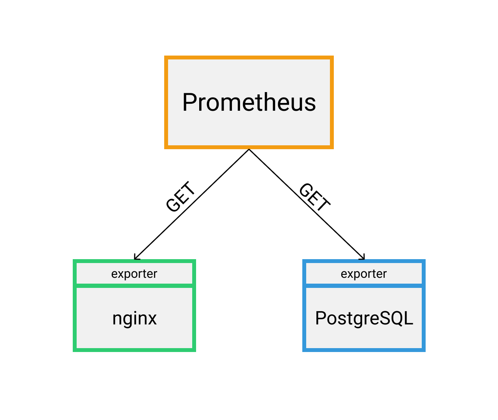

# prometheus-init

Prometheus — приложение для мониторинга систем, созданное в SoundCloud.
С момента его создания в 2012 году многие компании и организации используют Prometheus. Проект имеет очень активное сообщество разработчиков и пользователей.

Prometheus собирает и хранит метрики в виде временных рядов, т.е. информация о метриках хранится с отметкой времени вместе с необязательными данными вида ключ-значение.

## Метрики

Метрики - это числовые измерения, их можно сравнить с измерениями с приборов. Термин "временной ряд" означает, что в Prometheus записываются каждые измерения с отметкой времени.

Метрики могут отличаться в зависимости от проекта. Для веб-сервера это может быть время
выполнения запроса, для базы данных - это кол-во активных соединений или кол-во
активных запросов.

Метрики играют важную роль в понимании того, почему ваше приложение работает определенным образом. Предположим, вы запускаете веб-приложение и обнаруживаете, что оно работает медленно. Вам понадобится некая информация, чтобы узнать, что происходит с вашим приложением. Например, приложение может работать медленно, если количество запросов велико. Если у вас есть метрика для количества запросов, вы можете определить причину и увеличить количество серверов для обработки большого кол-ва запросов.

## Архитектура

Prometheus извлекает метрики из экспортеров.



Экспортеры выставляют наружу HTTP страницу. В странице хранится набор из определенных
метрик, которые разработчик задал. Страница с метриками представляет из себя просто
текст, где каждая строка записана в формате ключ-значение:

```
http_requests 2
```

В примере выше представлена только 1 метрика, однако на самом деле таких метрик очень много
и они могут иметь различный формат.

Информацию о том откуда брать метрики и с какой частотой Prometheus хранит в конфигурации. Например,
можно добавить экспортер на nginx и написать конфигурацию для Prometheus, чтобы извлекал
оттуда метрики с частотой 5 секунд.

## PromQL

Prometheus является базой данных. Как и из любой базы, из нее можно извлекать данные.
Чтобы сформировать запрос на получение данных используется свой язык - PromQL.

Grafana использует PromQL для визуализации данных.

## Полезное

- [Prometheus Overview](https://prometheus.io/docs/introduction/overview/)
- [Полное руководство по Prometheus](https://slurm.io/tpost/egiyf928zy-polnoe-rukovodstvo-po-prometheus)
