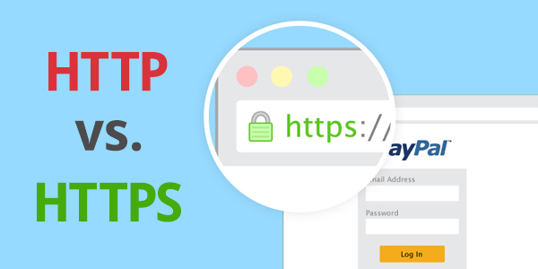

# nginx-cert



Как DevOps'еру, вам придется настраивать HTTPS сертификат на nginx сервер.

Это нужно, чтобы обезопасить соединение клиентов к вашему сайту. Без него сторонние
программы могут перехватить ваш трафик и посмотреть что передается между клиентом и сервером.

Для того, чтобы перехватчик не мог узнать содержимое сообщении, соединение шифруется
с помощью SSL сертификатов. И когда ваш сайт работает с SSL шифрованием, то называют
такой протокол HTTP**S**, где "S" - означает "Secure" (рус. "безопасный").

К тому же, к HTTPS сайтам такие поисковики как Google относятся лучше. Такие
сайты выше других в выдаче поисковых результатов.

В этом уроке, вам предстоит установить SSL сертификат на nginx `server` блок.

### Полезное

- [Configuring HTTPS servers](http://nginx.org/en/docs/http/configuring_https_servers.html)
- [Как работает HTTPS ...в комиксах! 🌈 🎉 🍕](https://howhttps.works/ru/)
- [Nginx и https. Получаем класс А+](https://habr.com/ru/post/252821/)

### Задание

1. Настройте `server` блок, который слушает 443 порт.
2. Установите `server_name` равным значению `jusan.kz`.
3. Добавьте `location /secret_word` блок, который возвращает строку `jusan-nginx-cert` со статусом `201`.
4. Настройте сертификат и приватный ключ. Файлы по ссылке ниже:
   - [track-devops.crt](https://stepik.org/media/attachments/lesson/686238/track-devops.crt)
   - [track-devops.key](https://stepik.org/media/attachments/lesson/686238/track-devops.key)
5. Настройте параметр `ssl_dhparam`.

Чтобы проверить запрос, запустите команду:

```bash
curl -H "Host: jusan.kz" -k https://localhost/secret_word
```

Флаг `-k` нужен для того, чтобы `curl` не ругался на самоподписанный сертификат.

---
