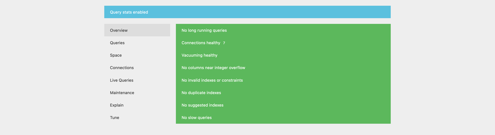

# pgsql-pghero

PgHero - это замечательный дэшборд для получения информации по поведению
PostgreSQL. В нем можно узнать проблемные места в базе данных и получить
рекомендации по оптимизации состояния БД.

### Полезное

- [Docker Postgres](https://hub.docker.com/_/postgres/)
- [PgHero](https://github.com/ankane/pghero)

### Задание

1. Пройти по ссылке задания в GitHub Classroom
   
   Задание выполняется в GitHub Classroom. После выполнения пришлите свою ссылку на рецензию ревьюеру в Stepik ([ССЫЛКА GITHUB CLASSROOM])
2. Создайте скрипт `setup.sh`, который:
   - запускает контейнеры для `postgres` и для `pghero`;
   - `postgres` должен запускать образ `postgres:14` и иметь имя `jusan-postgres`;
   - `pghero` должен запускать образ `ankane/pghero:v2.8.2` и иметь имя `jusan-pghero`;
   - `postgres` должен поднимать [бэкап](https://stepik.org/media/attachments/lesson/702368/dump.sql) в базу данных deadline;
   - `postgres` имеет порты `5432:5432`;
   - `pghero` имеет порты `8080:8080`;
   - можно оформить в `docker-compose.yml`
3. Активировать [Query Stats](https://github.com/ankane/pghero/blob/master/guides/Query-Stats.md) для PgHero
   в `postgres`.
4. Запустить `setup.sh` и проверить работоспособность сервисов.
5. Зайдите на [127.0.0.1:8080](http://127.0.0.1:8080), должна открыться страница как ниже.
6. Запушить в гит все необходимые файлы для запуска контейнеров.



Чтобы проверить правильно ли запущено все, запустите тестировщик [checker-pghero.sh](https://stepik.org/media/attachments/lesson/702368/checker-pghero.sh).

```bash
bash checker-pghero.sh
```

---

### Ответ
