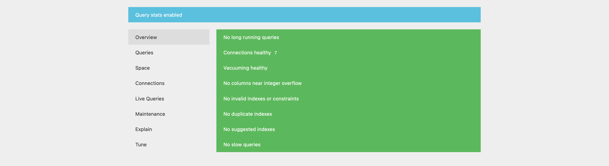

## Рецензия

### Дополнительная информация


Рецензия - это проверка проекта другого учащегося. Перед тем, как приступить к рецензированию, ознакомьтесь с правилами проведения рецензии.

**Правила рецензии:**

- Проверять только выполненную работу.
- Следовать указаниям критериев оценки.
- Если проект учащегося соответствует критерию, то ставьте 1.
- Если проект учащегося не соответствует критерию, то ставьте 0.

### Критерий оценки #1

GitHub ссылка открывает страницу на репозиторий с выполненным заданием.

Если это не так, то ставьте оценку 0 и заканчивайте проверку.

### Критерий оценки #2

Запустите команду:

```bash
bash ./setup.sh
```

Команда должна выполниться успешно.

### Критерий оценки #3

Запустите [тестировщик](https://stepik.org/media/attachments/lesson/702368/checker-pghero.sh):

```bash
bash checker-pghero.sh
```

### Критерий оценки #4

Зайдите на [127.0.0.1:8080](http://127.0.0.1:8080) должна открыться страница как на скриншоте ниже.


