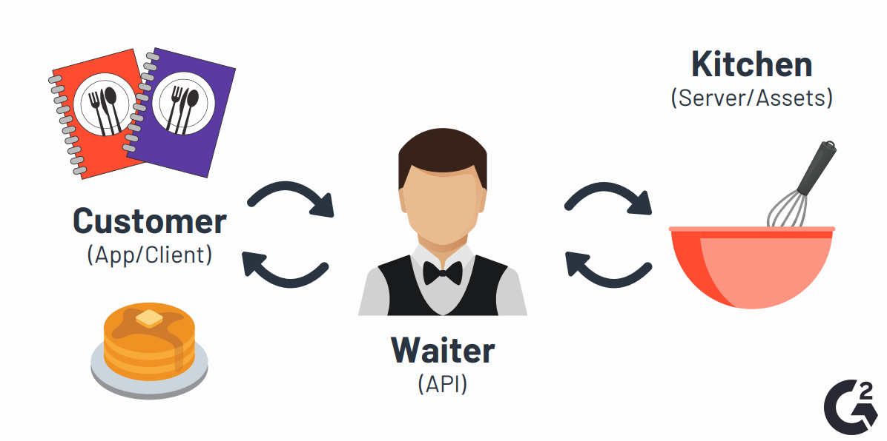

# api-intro

Всё в интернете живет где-то на удаленном сервере. Доступ к этим ресурсам осуществляется по запросу. Например, когда вы вводите в браузере [stepik.org](https://stepik.org), ваш запрос отправляется на сервера Stepik. Затем, когда ваш браузер получает ответ, он отображает его в вашем браузере. Это взаимодействие обеспечивается работой **API** (англ. _**A**pplication **P**rogramming **I**nterface_ — программный интерфейс приложения).

### Что такое API простыми словами?

API похож на мессенджер, который принимает запросы и возвращает ответы. Когда вы делаете заказ в ресторане, официант принимает ваш заказ, передает его на кухню и возвращается с вашей едой. В этом сценарии официант выступает в роли API или посредника.

### Что означает API?

**API** (англ. _**A**pplication **P**rogramming **I**nterface_) означает программный интерфейс приложения. Это позволяет двум приложениям взаимодействовать друг с другом для доступа к данным. Каждое действие, которое вы выполняете на своем телефоне, например, отправка прямого сообщения или проверка банковского счета, использует API для доступа и отправки этой информации.

### Как использовать API?

Для API обычно требуется ключ API. Просмотрите документацию API для получения инструкций и требований по доступу. Самый простой способ использовать API — использовать HTTP клиенты как `curl` или более продвинутый с графическим интерфейсом `Postman`.

API позволяют программным сервисам взаимодействовать друг с другом. Но на каком языке они общаются?

API в основном общаются через HTTP запросы:

- GET: запрашивает данные с сервера.
- POST: отправляет новую информацию на сервер.
- PUT: вносит изменения в существующие данные на сервере.
- DELETE: удаляет существующую информацию с сервера.
- и много других по [ссылке](https://ru.wikipedia.org/wiki/HTTP#%D0%9C%D0%B5%D1%82%D0%BE%D0%B4%D1%8B)

Данные на API передаются следующими способами:

- Header. Через HTTP заголовки передают секретные токены для доступа к API.
- Body. Через тело запроса передают всю важную информацию.
- Cookies. Через куки передают сессию пользователя.
- URL query. Через query передают дополнительную информацию к запросу.

### Полезные ссылки

- [Что такое API?](https://habr.com/ru/post/464261/)
- [Введение в REST API](https://habr.com/ru/post/483202/)
