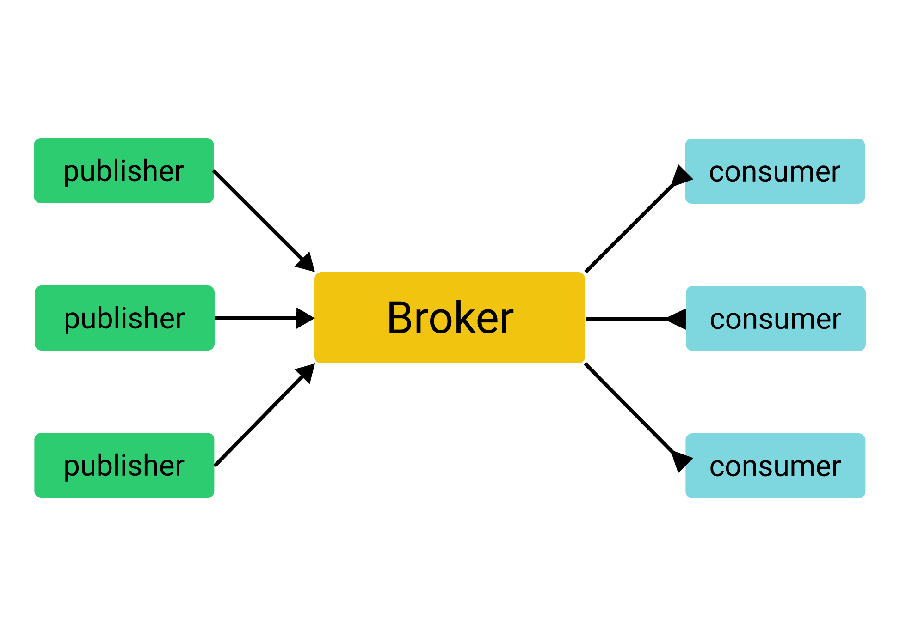

# rabbitmq-init

RabbitMQ — это брокер сообщений, который можно использовать, чтобы позволить разным сервисам обмениваться данными через общий протокол. RabbitMQ может работать как очередь заданий, который отправляет таски распределенным исполнителям.

Очередь сообщений (англ. "message queuing") — это метод коммуникации между разными сервисами. Благодаря очередям сообщений сервисы могут оставаться полностью независимыми при выполнении своих индивидуальных задач. Сообщения обычно представляют собой небольшие запросы, ответы, обновления статуса или даже небольшую информацию. Очередь сообщений предоставляет временное место для хранения этих сообщений, позволяя приложениям отправлять и получать их по мере необходимости.

Сообщения идут в одном направлении, от издателя (англ. "publisher") к брокеру и, наконец, к потребителю (англ. "consumer"):

Издатель публикует сообщение брокеру, который доставит данные потребителю. Если требуется ответ, он придет через некоторое время через тот же механизм, но в обратном порядке (роли потребителя и издателя поменяются местами).

Следующая диаграмма иллюстрирует слабую зависимость между издателем и потребителем:

Если один из сервисов не будет работать, другая часть системы будет независимо работать, и сообщения, которые должны быть отправлены между ними, будут ждать в очереди.

Архитектура, представленная через очередь сообщений, позволяет следующее:

- Издатели или потребители могут обновляться один за другим, не влияя друг на друга.
- Производительность каждой стороны оставляет другую сторону незатронутой.
- Издатели или потребители могут выходить из строя, не влияя друг на друга.
- Количество реплик издателей и потребителей может независимо масштабироваться.
- Потребители и издатели могут быть реализованы на разных технологиях.

## AMQP

AMQP — это открытый стандартный протокол, который определяет, как система может обмениваться сообщениями. Протокол определяет набор правил, которым должны следовать сервисы, которые будут взаимодействовать друг с другом.

Ниже приведен список основных концепций AMQP:

- **Broker**. Брокер — это часть программного обеспечения, которая получает сообщения от одной службы и доставляет их другой службе.
- **Connection**. Физическое сетевое (TCP) соединение между приложением (издатель/потребитель) и брокером. Когда клиент отключается или происходит системный сбой, соединение закрывается.
- **Channel**. Канал — это виртуальное соединение внутри соединения. Он переиспользует соединение, без необходимости повторной авторизации и открытия нового TCP соединения. Когда сообщения публикуются или потребляются, это делается по каналу. В рамках одного соединения может быть установлено множество каналов.
- **Exchange**. Данный объект отвечает за применение правил маршрутизации для сообщений, гарантируя, что сообщения достигают своего конечного пункта назначения. В какой очереди окажется сообщение, зависит от правил. Правила маршрутизации могут быть прямой (точка-точка), тематической (публикация-подписка), разветвленнойй (multicast).
- **Queue**. Очередь представляет собой последовательность элементов; в данном случае сообщения. Очередь существует в брокере.
- **Binding**. Привязка — это виртуальная связь между обменом и очередью в брокере. Он позволяет сообщениям перетекать из брокера в очередь.
- **Виртуальный хост, vhost**. В брокере существует виртуальный хост. Это способ разделения пространств под приложения, которые используют один и тот же инстанс RabbitMQ. Пользователи, биржи, очереди и т.д. изолированы на одном конкретном виртуальном хосте. Пользователь, подключенный к определенному виртуальному хосту, не может получить доступ в другой виртуальный хост. Пользователи могут иметь разные права доступа к разным виртуальным хостам.

## RabbitMQ

RabbitMQ — это реализация брокера AMQP на языке Erlang. Erlang был выбран из-за встроенной поддержки создания высоконадежных и распределенных приложений. Erlang используется в телекоммуникационных коммутаторах, и известно, что общая доступность системы составляет девять девяток (это всего 32 миллисекунды простоя в год). Erlang может быть запущен в любой операционной системе.

Для надежности данных RabbitMQ полагается на Mnesia, встроенную базу данных Erlang, который хранит в памяти/файле. Mnesia хранит информацию о пользователях, очередях, привязках и так далее. Индекс очереди хранит позиции сообщения и информацию о том, было ли сообщение доставлено или нет.

Для кластеризации в основном полагается на возможности кластеризации Erlang. RabbitMQ можно настроить на одном автономном экземпляре или в виде кластера на нескольких серверах.

Брокеры RabbitMQ можно соединять вместе с помощью различных методов, таких как федерация, для формирования обмена сообщениями с интеллектуальной маршрутизацией сообщений между брокерами и возможностью охвата нескольких дата-центров.

## RabbitMQ в реальной жизни

Наиболее распространенный вариант использования RabbitMQ — это издатель и очередь с потребителем. Это можно представить, как канал, где одно приложение помещает сообщения в канал, а другое приложение читает сообщения из этого канала. Сообщения доставляются в порядке поступления.

Очереди сообщений часто используются между микросервисами.

Архитектурный стиль микросервисов делит приложение на небольшие сервисы, а целое приложение представляет собой сумму этих микросервисов. Сервисы не связаны напрямую друг с другом. Вместо этого они используют очереди сообщений. Одна служба асинхронно отправляет сообщения в очередь, и эти сообщения доставляются в нужное место назначения, когда потребитель готов.

## События и таски

События — это уведомления, сообщающие сервисам, когда что-то произошло. Сервис может подписываться на события другого сервиса и реагировать, создавая и обрабатывая таски. Типичный вариант использования — это когда RabbitMQ действует как очередь задач, обрабатывающая долгие и сложные операции.

Примеры:

- Представьте социальную сеть как Instagram. Каждый раз, когда кто-то публикует новый пост, подписчики должны быть уведомлены о новом посте. Миллионы людей могут одновременно публиковать новый пост. С помощью очередей сообщений можно поставить задачу в очередь для каждого события по мере поступления. Когда консьюмер получает запрос, он извлекает список подписчиков отправителя и уведомляет каждого.

- Другой пример, инструмент рассылки по электронной почте, который рассылает тысячи писем тысячам пользователей. Может быть такое, что многие пользователи запускают массовые сообщения одновременно. Инструмент рассылки новостей по электронной почте должен быть в состоянии обрабатывать такой объем сообщений. Каждое письмо может быть добавлено в очередь для консьюмера с информацией что отправлять и кому. Каждое электронное письмо обрабатывается одно за другим, пока все электронные письма не будут отправлены.

## Преимущества очереди сообщений

Коммуникация между различными службами играет важную роль в распределенных системах. Существует много примеров использования очереди сообщений, поэтому выделим некоторые функции и преимущества очереди сообщений в микросервисных архитектурах:

- **Упрощение разработки и поддержки**: разделение приложения на микросервисы дает разработчикам свободу писать код для конкретного сервиса на любом языке. Такой код проще поддерживать и обновлять;
- **Изоляция неисправности**: неисправность может быть локализована и, таким образом, не повлияет на другие сервисы.
- **Повышение продуктивности**: разные разработчики могут работать над разными микросервисами одновременно. Каждую службу можно протестировать отдельно, чтобы определить готовность всей системы.
- **Улучшенная масштабируемость**: микросервисы также позволяют легко масштабировать по необходимости. Можно добавить больше потребителей, если очередь сообщений растет. Добавление новых компонентов только к одной службе легко сделать без изменения какой-либо другой службы.
- **Простота понимания**: поскольку каждый модуль в микросервисной архитектуре представляет собой единую функциональность, ознакомиться с соответствующими деталями задачи несложно.
