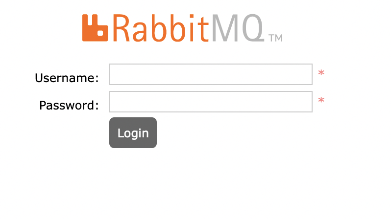

# rabbitmq-setup

## Установка RabbitMQ

Установку RabbitMQ нужно производить из офф.репозитория разработчика RabbitMQ.

Инструкции по установке доступны по [ссылке](https://www.rabbitmq.com/download.html).

Также, для локального тестирования можно запустить в [контейнере](https://hub.docker.com/_/rabbitmq).

## Установка админ панели Management (Web UI)

RabbitMQ по умолчанию не устанавливает менеджмент консоль. Менеджмент консоль позволяет легко заглянуть в работающий экземпляр RabbitMQ и управлять ею.
RabbitMQ поставляется вместе с CLI-приложением - `rabbitmq-plugins` для установки и удаления дополнительных плагинов. Для того чтобы активировать mangement консоль:

```bash
sudo rabbitmq-plugins enable rabbitmq_management
```

Откройте страницу админ панели [localhost:15672](http://localhost:15672) - вы должны увидеть следующее:



## Управление пользователями

Одним из встроенных CLI-приложений RabbitMQ является `rabbitmqctl`, который представляет собой инструмент для управления инстансами RabbitMQ и используется для настройки всех аспектов брокера. Для того чтобы настроить администратора в RabbitMQ, введите следующее:

```bash
$ sudo rabbitmqctl add_user admin password123
Adding user "admin" ...
$ sudo rabbitmqctl set_user_tags admin administrator
Setting tags for user "admin" to [administrator] ...
```

По умолчанию в RabbitMQ создается пользователь `guest` с паролем `guest`. Измените этот пароль на другой, как показано ниже:

```bash
sudo rabbitmqctl change_password guest guest123
```

Откройте страницу админ панели [localhost:15672](http://localhost:15672) и залогиньтесь как `admin`.

В данный момент пользователь `admin` не имеет доступ к очередям сообщений на любом виртуальном хосте. Необходимо создать еще одного пользователя в целях разработки, чтобы этот пользователь мог подключаться к RabbitMQ.

Создадим пользователя `developer` с паролем `passwordDeveloper`:

```bash
$ sudo rabbitmqctl add_user developer passwordDeveloper
Adding user "developer" ...
```

Как обсуждалось ранее, RabbitMQ поддерживает понятие `vhosts`, где разные пользователи могут иметь разные права доступа.

Создадим виртуальный хост `dev-vhost`:

```bash
$ sudo rabbitmqctl add_vhost dev-vhost
Adding vhost "dev-vhost" ...
```

## Настройка виртуальных хостов

RabbitMQ имеет `vhost` по умолчанию, который называется `/`. У пользователя `guest` есть полные права на этот vhost. Хотя это удобно для быстрых тестов, рекомендуется создать отдельный виртуальный хост, чтобы запустить его с нуля без непредвиденных проблем.

На текущий момент пользователи `admin` и `developer` не имеют права делать что-либо на `dev-vhost`. Чтобы исправить это, предоставим полные права на него следующим образом:

```bash
$ sudo rabbitmqctl set_permissions -p dev-vhost admin ".\*" ".\*" ".\*"
Setting permissions for user "admin" in vhost "dev-vhost" ...
```

```bash
$ sudo rabbitmqctl set_permissions -p dev-vhost developer ".\*" ".\*" ".\*"
Setting permissions for user "developer" in vhost "dev-vhost" ...
```

Объясним, что только что было сделано: большая часть команды проста, но часть `.\*`, `.\*`, `.\*` выглядит немного загадочно, так что проанализируем ее.

Это триплет разрешений для виртуального хоста, который предоставляет разрешения на

- настройку,
- запись
- чтение

для конкретного пользователя и виртуального хоста.
